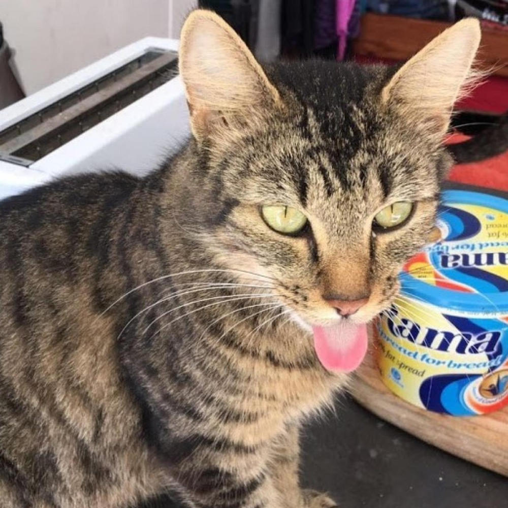
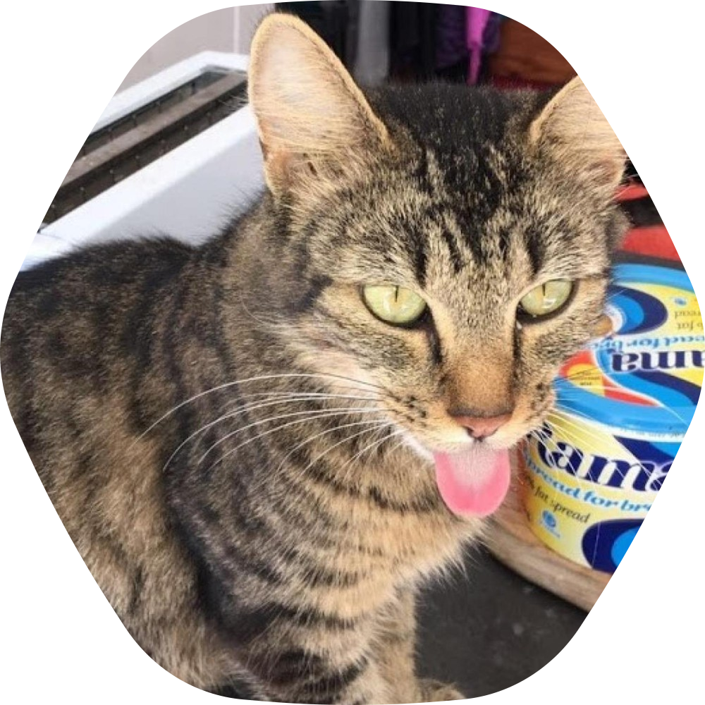
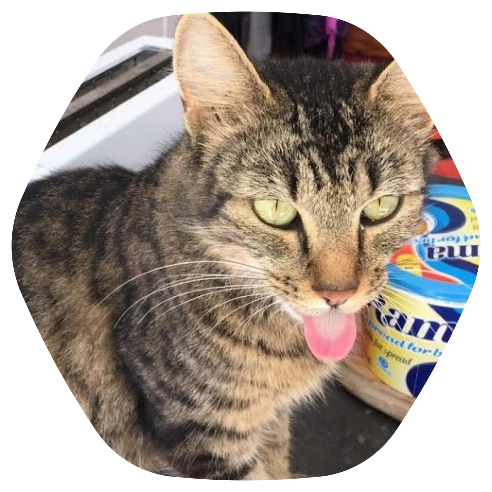

# Twitter NFT Masks

Convert any square image into one that looks like the Twitter NFT profile pictures.

# Dependencies

Imagemagick (provides the `convert` command we will use).

There's two versions:

1. `mask.svg`: Final image will be displayed as a square.
1. `mask_circle.svg`: Final image will be displayed as a circle. The mask part is slightly smaller to fit into the circle completely.

# Convert the SVG mask to PNG

To use the mask, we first need to convert it to the right size.

These SVGs use 96 for the DPI, so when we create the PNG mask, we need to change the density so that we don't get aliasing for larger images. If your image is smaller than 1000px, you don't need to worry with changing the density.

The size of the SVGs are 1000px. So to calculate the density, we will do `roundup(target/1000) * 96`.

### Example

So if our target is 5000, we get `roundup(5000/1000) * 95 = 480`. So our density to not have aliasing will be `480`.

```
$ convert -density 480 -background none mask.svg -resize 5000x5000 mask.png
```

`-density 480` sets the density of the canvas using the value we calculated earlier.

`-background none` sets the background to be transparent in the output image.

`mask.svg` our input mask.

`-resize 5000x5000` our target image size.

`mask.png` our output mask.

# Apply the PNG mask to your image

Take the mask we created in the previous step and apply it to your image.

```
$ convert pfp_square.jpeg mask.png -compose CopyOpacity -composite pfp_hexagon.png
```

`pfp_square.jpeg` the image you want to convert.

`mask.png` the mask we created in the previous step.

`-compose CopyOpacity` copies the opacity values from the top layer (`mask.png`) to the bottom layer (`pfp_square.jpeg`).

`-composite` tells `convert` that we want to use the layer we created in the `-compose ...` part of the command.

`pfp_hexagon.png` our output image. PNG is not the most efficient web image file format, but it will be the most supported file format that contains a transparency layer.

Other output options are `webp` and `avif`. With these lossy formats, you will want to use the `-quality` flag. A quality of `95` is very good. `75` is the default.

```
$ convert pfp_square.jpeg mask.png -compose CopyOpacity -composite -quality 95 pfp_hexagon.webp
```


# Full example

### Normal mask

```
$ convert -density 96 -background none mask.svg -resize 1000x1000 mask.png
$ convert pfp_square.jpeg mask.png -compose CopyOpacity -composite pfp_hexagon.png
```

### Circle mask

```
$ convert -density 96 -background none mask_circle.svg -resize 1000x1000 mask_circle.png
$ convert pfp_square.jpeg mask_circle.png -compose CopyOpacity -composite pfp_circle_hexagon.png
```

### Input image: pfp_square.jpeg



### Output image using the normal mask: pfp_hexagon.png



### Output image using the circle mask: pfp_curcle_hexagon.png


